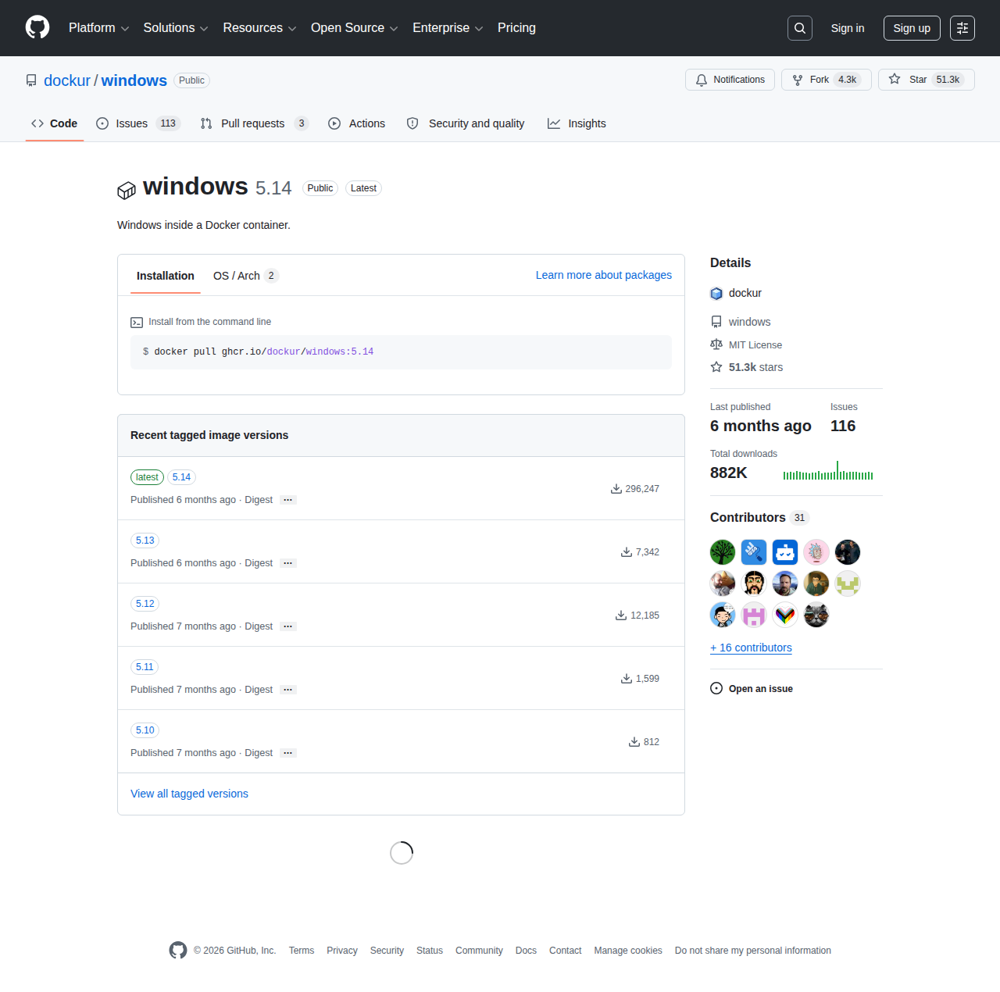

# Visited: https://github.com/-/dockur/packages/container/package/windows
**Time:** Sat May  9 19:09:36 UTC 2026

## Screenshot

## Raw HTML
[page.html](./page.html)

## Downloaded Media (4 files)
## Downloaded Media Files

## Other Links
- [#start-of-content](#start-of-content)
- [/](/)
- [/dockur](/dockur)
- [/dockur/windows](/dockur/windows)
- [/dockur/windows/actions](/dockur/windows/actions)
- [/dockur/windows/contributors_list?count=31&amp;current_repository=windows&amp;items_to_show=15](/dockur/windows/contributors_list?count=31&amp;current_repository=windows&amp;items_to_show=15)
- [/dockur/windows/graphs/contributors](/dockur/windows/graphs/contributors)
- [/dockur/windows/issues](/dockur/windows/issues)
- [/dockur/windows/pulls](/dockur/windows/pulls)
- [/dockur/windows/pulse](/dockur/windows/pulse)
- [/dockur/windows/security](/dockur/windows/security)
- [/dockur/windows/stargazers](/dockur/windows/stargazers)
- [/login?return_to=%2Fdockur%2Fwindows](/login?return_to=%2Fdockur%2Fwindows)
- [/login?return_to=https%3A%2F%2Fgithub.com%2Fdockur%2Fwindows%2Fpkgs%2Fcontainer%2Fwindows](/login?return_to=https%3A%2F%2Fgithub.com%2Fdockur%2Fwindows%2Fpkgs%2Fcontainer%2Fwindows)
- [/manifest.json](/manifest.json)
- [/opensearch.xml](/opensearch.xml)
- [/orgs/dockur/packages/container/windows/548068277?tag=5.10](/orgs/dockur/packages/container/windows/548068277?tag=5.10)
- [/orgs/dockur/packages/container/windows/549048690?tag=5.11](/orgs/dockur/packages/container/windows/549048690?tag=5.11)
- [/orgs/dockur/packages/container/windows/552060960?tag=5.12](/orgs/dockur/packages/container/windows/552060960?tag=5.12)
- [/orgs/dockur/packages/container/windows/573872987?tag=5.13](/orgs/dockur/packages/container/windows/573872987?tag=5.13)
- [/orgs/dockur/packages/container/windows/585652825/readme?is_package_page=true](/orgs/dockur/packages/container/windows/585652825/readme?is_package_page=true)
- [/orgs/dockur/packages/container/windows/585652825?tag=5.14](/orgs/dockur/packages/container/windows/585652825?tag=5.14)
- [/orgs/dockur/packages/container/windows/585652825?tag=latest](/orgs/dockur/packages/container/windows/585652825?tag=latest)
- [/orgs/dockur/packages/container/windows/versions?filters%5Bversion_type%5D=tagged](/orgs/dockur/packages/container/windows/versions?filters%5Bversion_type%5D=tagged)
- [/search/custom_scopes/check_name](/search/custom_scopes/check_name)
- [/signup?ref_cta=Sign+up&amp;ref_loc=header+logged+out&amp;ref_page=%2F%3Cuser-name%3E%2F%3Crepo-name%3E%2Fregistry_two%2Fpackages%2Fpackage_view&amp;source=header-repo&amp;source_repo=dockur%2Fwindows](/signup?ref_cta=Sign+up&amp;ref_loc=header+logged+out&amp;ref_page=%2F%3Cuser-name%3E%2F%3Crepo-name%3E%2Fregistry_two%2Fpackages%2Fpackage_view&amp;source=header-repo&amp;source_repo=dockur%2Fwindows)
- [https://archiveprogram.github.com](https://archiveprogram.github.com)
- [https://avatars.githubusercontent.com](https://avatars.githubusercontent.com)
- [https://avatars.githubusercontent.com/u/133648939?v=4](https://avatars.githubusercontent.com/u/133648939?v=4)
- [https://docs.github.com](https://docs.github.com)
- [https://docs.github.com/](https://docs.github.com/)
- [https://docs.github.com/packages/getting-started-with-github-container-registry/about-github-container-registry](https://docs.github.com/packages/getting-started-with-github-container-registry/about-github-container-registry)
- [https://docs.github.com/search-github/github-code-search/understanding-github-code-search-syntax](https://docs.github.com/search-github/github-code-search/understanding-github-code-search-syntax)
- [https://docs.github.com/site-policy/github-terms/github-terms-of-service](https://docs.github.com/site-policy/github-terms/github-terms-of-service)
- [https://docs.github.com/site-policy/privacy-policies/github-privacy-statement](https://docs.github.com/site-policy/privacy-policies/github-privacy-statement)
- [https://github-cloud.s3.amazonaws.com](https://github-cloud.s3.amazonaws.com)
- [https://github.blog](https://github.blog)
- [https://github.blog/changelog](https://github.blog/changelog)
- [https://github.com](https://github.com)
- [https://github.com/accelerator](https://github.com/accelerator)
- [https://github.com/collections](https://github.com/collections)
- [https://github.com/customer-stories](https://github.com/customer-stories)
- [https://github.com/dockur](https://github.com/dockur)
- [https://github.com/dockur/windows](https://github.com/dockur/windows)
- [https://github.com/dockur/windows/issues](https://github.com/dockur/windows/issues)
- [https://github.com/enterprise](https://github.com/enterprise)
- [https://github.com/enterprise/startups](https://github.com/enterprise/startups)
- [https://github.com/features](https://github.com/features)
- [https://github.com/features/actions](https://github.com/features/actions)
- [https://github.com/features/code-review](https://github.com/features/code-review)

## Stats
- Links: 193
- Media: 4
